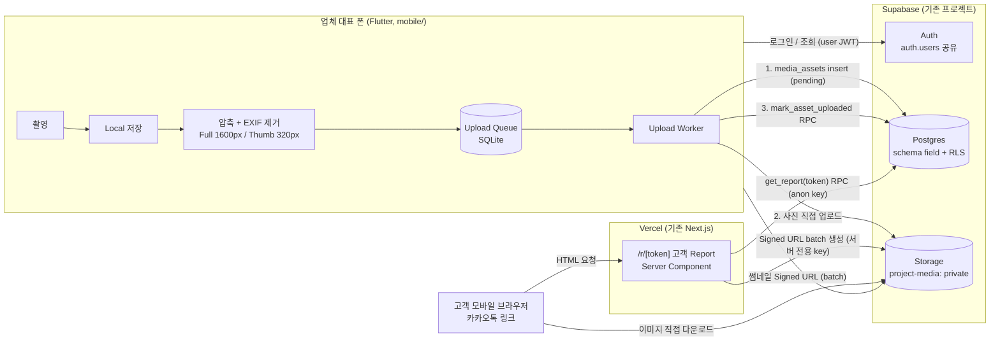

# A. Architecture / G. Customer Report / H. Portfolio 확장

## A. Architecture Diagram



핵심:
- **사진 트래픽은 Vercel을 거치지 않는다.** 업로드는 폰 → Storage, 다운로드는 Storage → 고객.
- Vercel은 Report HTML과 Signed URL 생성만 담당한다.
- Flutter 앱은 Vercel API를 쓰지 않고 Supabase에 직접 접근한다. 권한은 RLS와 Storage 정책이 보장한다.
- 서버에서 꼭 해야 하는 일(Report 조회 검증, 업로드 검증)은 Postgres 함수(RPC)로 처리해 Serverless Function을 늘리지 않는다.

### 코드 배치 (Module 경계)

```text
mobile/                          Flutter 앱
  lib/core/media_storage/        MediaStorage 인터페이스 + Supabase 구현 (Provider 교체 지점)
  lib/features/auth/
  lib/features/projects/         현장 / 공간 / PhotoPair
  lib/features/capture/          촬영, 압축, EXIF 제거
  lib/features/upload_queue/     SQLite Queue + Worker
  lib/features/report_share/     링크 생성 / 폐기
app/r/[token]/route.ts           고객 Report HTML (Route Handler: root layout 의 분석 스크립트가 token URL 을 수집하지 않도록 React layout 을 거치지 않음)
app/r/[token]/media/route.ts     Report 다음 페이지 (JSON, 24쌍씩)
lib/field/                       Report 데이터 조회, media URL 생성 (서버 전용)
migrations/field_*.sql           schema, 테이블, RLS, 함수, Storage 정책
app/api/cron/field-cleanup/      삭제/고아 파일 정리 (2단계, MVP 후반)
```

V1 코드(`lib/supabase/*`, `components/*` 등)는 import하지 않는다. `lib/field`는 V1과 독립적으로 둔다.

### 기존 앱과의 접점

- `middleware.ts`: `/r/` 를 `isHomepageFastPath` 와 같은 빠른 경로에 추가한다. 고객 요청마다 Auth 조회와 V1 세션 처리를 하지 않게 하기 위함.
- Supabase 대시보드: API 설정의 Exposed schemas에 `field` 를 추가해야 Flutter/Next.js에서 접근할 수 있다.

---

## G. Customer Report 접근 방식

### 흐름

```text
대표: [링크 만들기] → create_report_share(project_id) RPC
      → DB에는 sha256(token)만 저장, 원문 token은 응답으로 한 번만 받음
      → 앱이 원문을 기기 보안 저장소에 share_id별로 보관
      → https://{앱 도메인}/r/{token} 을 카카오톡으로 전송
      [링크 다시 보내기] → 기기에 보관된 원문으로 같은 링크 재전송
      (폰 교체/재설치로 원문이 없으면 → "새 링크 만들기" 안내, 이전 링크는 목록에서 폐기 가능)

고객: 링크 클릭
  → Vercel /r/[token] (Server Component)
      1. get_report(token) RPC (anon key)
         - sha256(token)으로 조회, active 이고 만료 전인지 DB에서 검사
         - 업체명, 현장명, 서비스 종류 이름, 시/군/구 이름, 작업일, 공간 목록 반환
           (고객 이름·전화·도로명·동호수 없음)
         - 첫 페이지 사진 경로 (12쌍 = 최대 24장)
         - view_count +1, last_viewed_at 갱신
      2. 첫 페이지 경로로 Signed URL을 한 번의 batch 요청으로 생성 (만료 1시간)
      3. HTML 응답: 업체명, 현장 정보, 첫 화면 썸네일
  → 브라우저가 이미지를 Storage에서 직접 받음 (썸네일 먼저, Full은 탭 시 로드)
  → 스크롤이 끝에 가까워지면 /r/[token]/media?cursor= 로 다음 24쌍 요청
     (get_report_media RPC + Signed URL batch). 사진이 24장 이하인 현장은 추가 요청 없음
```

### 결정과 이유

| 결정 | 이유 |
|------|------|
| Token: 32바이트 랜덤, base64url (43자) | 추측 불가. `/r/1`, `/r/{project_id}` 방식 금지 |
| DB에는 `token_hash` 만, 원문은 대표 폰에만 | DB가 유출돼도 고객 링크 복원 불가. 같은 폰에서 재전송 UX 유지. 비교는 [05-design-review.md](05-design-review.md) 5번 |
| Token 상태: `active` / `revoked` + `expires_at` | 대표가 즉시 링크를 끌 수 있어야 함 |
| 사진을 페이지 단위로 로드 (첫 12쌍, 이후 24쌍씩) | 현장당 100~200장이어도 첫 HTML 크기와 Signed URL 수가 일정 |
| Report 데이터는 `SECURITY DEFINER` 함수로만 노출 | anon 사용자에게 테이블 직접 SELECT 권한을 주지 않음. 반환 컬럼을 함수가 통제 |
| Signed URL 생성만 서버 전용 key 사용 | Private bucket 서명에는 권한이 필요. 서명 대상은 RPC가 검증해 돌려준 경로로 한정 |
| 응답 캐시: `no-store` | Signed URL이 1시간 뒤 만료되고, 링크 폐기가 즉시 반영돼야 함 (Security > Performance) |
| 고객에게 보일 사진 선택: `photo_pairs.include_in_report` | 필요한 사진만 제한적으로 노출 |

### 비용/성능 영향

- 조회 1회 = Vercel Function 1회 + RPC 1회 + Signed URL batch 1회. 이미지 트래픽은 Vercel에 0.
- 사진이 많은 현장은 스크롤할 때만 추가 요청 (200장 현장도 최대 4회).
- 이미지 Egress는 고객이 실제로 본 만큼만 발생 (썸네일 중심).
- 병목 가능성: 인기 Report가 대량 조회되면 매번 RPC와 서명 발생. 필요해지면 짧은 캐시(서명 만료보다 짧게)를 검토. MVP에서는 불필요.

### 공유 링크 도메인

기존 V1 도메인을 그대로 쓴다. 나중에 전용 도메인이 필요하면 `/r/` 경로만 옮기면 된다.

---

## H. Public Portfolio 확장 방식 (MVP에서 구현하지 않음)

지금 할 일은 **막히지 않게만** 하는 것이다.

### 지금 반영된 구조

- 고객 개인정보(이름, 전화번호, 도로명주소, 동/호수)는 `project_private_details` 테이블로 분리되어 있다. 포트폴리오 Query가 개인정보 테이블을 건드릴 일이 없다.
- 서비스 종류는 안정적인 code(`service_types.code`: MOVE_IN, OFFICE 등)로 저장된다. 종류별 검색에 그대로 쓸 수 있다.
- 지역은 법정동코드 기준 `region_sido_code`(2자리), `region_sigungu_code`(5자리)로 저장된다. 지역별 검색에 그대로 쓸 수 있다.
- 사진 단위는 `photo_pairs` 다. 포트폴리오 항목이 PhotoPair를 참조하면 된다.
- Storage 경로와 URL 생성이 추상화되어 있어 public bucket을 추가하기 쉽다.

### 향후 구조 (예시)

```text
portfolio_items (company_id, photo_pair_id, title,
                 service_type_code, region_sido_code, region_sigungu_code,  -- projects에서 복사
                 published_month, status, published_at)
  INDEX (region_sigungu_code, service_type_code, published_at DESC)
bucket portfolio-public (public)
regions (code, level, name, parent_code, is_active)   -- 검색 필터용 지역 마스터
region_code_changes (old_code, new_code)               -- 행정구역 개편 매핑
```

- 소비자 검색은 `projects` 가 아니라 `portfolio_items` 에서 한다. 비공개 현장 데이터와 공개 검색 데이터의 경계를 테이블로 나눈다.

- 공개는 **대표가 명시적으로 선택**한 PhotoPair만. 자동 공개 없음.
- 공개할 때 사진을 private bucket에서 public bucket으로 **복사**한다. private 원본의 접근 정책은 그대로.
- 공개 사진은 재인코딩으로 메타데이터를 한 번 더 제거한다.
- 지역은 시/군/구 코드까지만. 상세주소, 동/호수, GPS는 공개 테이블에 컬럼 자체를 두지 않는다.
- 작업일은 월 단위(`published_month`)로 낮춘다. 작은 지역 + 정확한 날짜 + 사진 조합으로 고객 집이 특정되는 것을 막기 위함.
- 업체 홈페이지(`homepage` 기능)는 포트폴리오 공개 API를 호출하는 방식으로 연결한다. 테이블을 직접 공유하지 않는다.
