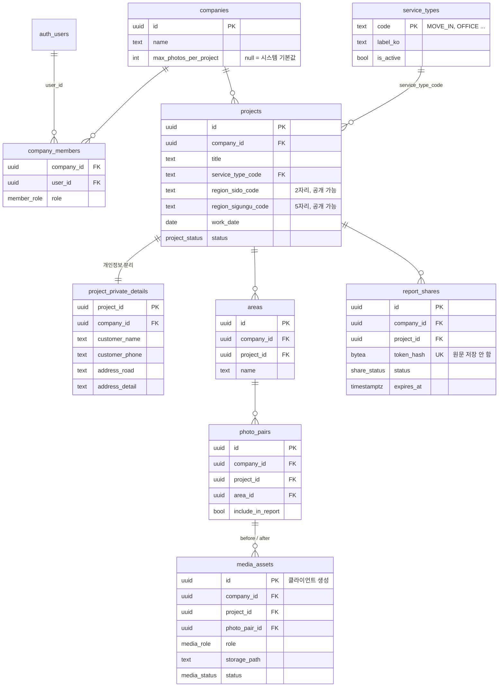

# B. ERD / C. Table Schema / D. RLS / I. Query & Index

모든 테이블은 Postgres schema `field` 에 둔다. V1의 `public.companies`, `public.users` 와 이름이 겹치지 않고, 모듈 경계가 DB에서도 드러난다.

핵심 계층은 그대로 유지한다.

```text
Company → Project → Area → PhotoPair → MediaAsset
```

이번 검토로 추가된 것(서비스 분류, 지역 코드, 사진 한도, token 해시)은 모두 **Project/Company의 컬럼 또는 참조 테이블**이며 계층 관계를 바꾸지 않는다. 검토 근거는 [05-design-review.md](05-design-review.md).

## B. ERD



설계 포인트:
- 모든 업무 테이블에 `company_id` 를 **중복 저장**한다. RLS가 join 없이 한 컬럼으로 판단할 수 있고, 향후 Company 단위 집계/삭제가 쉽다.
- 자식 테이블의 `company_id` 가 부모와 일치하는지는 트리거가 강제한다 (클라이언트가 다른 회사 id를 넣어도 거부).
- 대표 1인이라도 `company_members` 를 둔다. 직원 기능을 추가할 때 테이블 구조를 바꾸지 않고 role만 추가하면 된다.
- **공개 가능 데이터와 개인정보의 경계**: `projects` 에는 공개해도 되는 값(서비스 종류 code, 시/도·시/군/구, 작업일)만 둔다. 도로명주소, 동/호수, 고객 이름·전화번호는 `project_private_details` 에만 둔다.

## C. Table Schema

```sql
CREATE SCHEMA IF NOT EXISTS field;

CREATE TYPE field.member_role    AS ENUM ('owner');
CREATE TYPE field.project_status AS ENUM ('in_progress', 'completed');
CREATE TYPE field.media_role     AS ENUM ('before', 'after');
CREATE TYPE field.media_status   AS ENUM ('pending', 'uploaded', 'failed');
CREATE TYPE field.share_status   AS ENUM ('active', 'revoked');
-- 위 ENUM은 시스템 내부 상태값이라 거의 바뀌지 않는다.
-- 업무 분류(서비스 종류)처럼 늘어날 값은 ENUM이 아니라 참조 테이블로 둔다.

CREATE TABLE field.companies (
  id                      uuid PRIMARY KEY DEFAULT gen_random_uuid(),
  name                    text NOT NULL CHECK (char_length(name) BETWEEN 1 AND 100),
  max_photos_per_project  int CHECK (max_photos_per_project > 0),   -- null = 시스템 기본값
  created_at              timestamptz NOT NULL DEFAULT now(),
  deleted_at              timestamptz
);

CREATE TABLE field.company_members (
  company_id  uuid NOT NULL REFERENCES field.companies(id) ON DELETE CASCADE,
  user_id     uuid NOT NULL REFERENCES auth.users(id) ON DELETE CASCADE,
  role        field.member_role NOT NULL DEFAULT 'owner',
  created_at  timestamptz NOT NULL DEFAULT now(),
  PRIMARY KEY (company_id, user_id)
);

-- 서비스 종류: 안정적인 code + 바꿀 수 있는 표시 이름
CREATE TABLE field.service_types (
  code        text PRIMARY KEY CHECK (code ~ '^[A-Z][A-Z0-9_]{1,29}$'),
  label_ko    text NOT NULL,
  sort_order  int  NOT NULL DEFAULT 0,
  is_active   boolean NOT NULL DEFAULT true
);

INSERT INTO field.service_types (code, label_ko, sort_order) VALUES
  ('MOVE_IN',    '입주청소',       10),
  ('MOVE_OUT',   '이사청소',       20),
  ('OFFICE',     '사무실청소',     30),
  ('REGULAR',    '정기청소',       40),
  ('COMMERCIAL', '상가·매장청소',  50),
  ('ETC',        '기타',          999);

CREATE TABLE field.projects (
  id                   uuid PRIMARY KEY DEFAULT gen_random_uuid(),
  company_id           uuid NOT NULL REFERENCES field.companies(id),
  title                text NOT NULL CHECK (char_length(title) BETWEEN 1 AND 100),

  service_type_code    text NOT NULL REFERENCES field.service_types(code) ON UPDATE RESTRICT,
  service_type_note    text CHECK (char_length(service_type_note) <= 50),  -- ETC 등 보충 설명. 비공개 취급

  -- 공개 가능한 지역 (시/도, 시/군/구까지만). 법정동코드 앞자리 기준
  region_sido_code     text CHECK (region_sido_code ~ '^[0-9]{2}$'),
  region_sigungu_code  text CHECK (region_sigungu_code ~ '^[0-9]{5}$'),
  region_sido_name     text CHECK (char_length(region_sido_name) <= 20),     -- 입력 당시 이름 (스냅샷)
  region_sigungu_name  text CHECK (char_length(region_sigungu_name) <= 30),
  CONSTRAINT region_code_consistent
    CHECK (region_sigungu_code IS NULL OR left(region_sigungu_code, 2) = region_sido_code),

  work_date            date,
  status               field.project_status NOT NULL DEFAULT 'in_progress',
  created_by           uuid REFERENCES auth.users(id),
  created_at           timestamptz NOT NULL DEFAULT now(),
  updated_at           timestamptz NOT NULL DEFAULT now(),
  deleted_at           timestamptz
);

-- 고객 개인정보: Report / 향후 포트폴리오에서 절대 조회하지 않는 테이블
CREATE TABLE field.project_private_details (
  project_id      uuid PRIMARY KEY REFERENCES field.projects(id) ON DELETE CASCADE,
  company_id      uuid NOT NULL REFERENCES field.companies(id),
  customer_name   text CHECK (char_length(customer_name) <= 50),
  customer_phone  text CHECK (char_length(customer_phone) <= 20),
  address_road    text CHECK (char_length(address_road) <= 200),    -- 도로명/지번 주소
  address_detail  text CHECK (char_length(address_detail) <= 100),  -- 동/호수
  memo            text CHECK (char_length(memo) <= 1000),
  updated_at      timestamptz NOT NULL DEFAULT now()
);

CREATE TABLE field.areas (
  id          uuid PRIMARY KEY DEFAULT gen_random_uuid(),
  company_id  uuid NOT NULL REFERENCES field.companies(id),
  project_id  uuid NOT NULL REFERENCES field.projects(id) ON DELETE CASCADE,
  name        text NOT NULL CHECK (char_length(name) BETWEEN 1 AND 50),  -- 거실, 주방, 욕실1
  sort_order  int  NOT NULL DEFAULT 0,
  created_at  timestamptz NOT NULL DEFAULT now(),
  deleted_at  timestamptz
);

CREATE TABLE field.photo_pairs (
  id                 uuid PRIMARY KEY DEFAULT gen_random_uuid(),
  company_id         uuid NOT NULL REFERENCES field.companies(id),
  project_id         uuid NOT NULL REFERENCES field.projects(id) ON DELETE CASCADE,
  area_id            uuid NOT NULL REFERENCES field.areas(id) ON DELETE CASCADE,
  caption            text CHECK (char_length(caption) <= 200),
  include_in_report  boolean NOT NULL DEFAULT true,
  sort_order         int NOT NULL DEFAULT 0,
  created_at         timestamptz NOT NULL DEFAULT now(),
  deleted_at         timestamptz
);

CREATE TABLE field.media_assets (
  id                uuid PRIMARY KEY,               -- 클라이언트가 생성 (업로드 idempotency 키)
  company_id        uuid NOT NULL REFERENCES field.companies(id),
  project_id        uuid NOT NULL REFERENCES field.projects(id) ON DELETE CASCADE,
  photo_pair_id     uuid NOT NULL REFERENCES field.photo_pairs(id) ON DELETE CASCADE,
  role              field.media_role NOT NULL,
  provider          text NOT NULL DEFAULT 'supabase',
  bucket            text NOT NULL DEFAULT 'project-media',
  storage_path      text NOT NULL,                  -- companies/{cid}/projects/{pid}/{id}.jpg
  thumb_path        text NOT NULL,                  -- companies/{cid}/projects/{pid}/{id}_t.webp
  mime_type         text NOT NULL CHECK (mime_type IN ('image/jpeg', 'image/webp')),
  width             int,
  height            int,
  size_bytes        int CHECK (size_bytes <= 1048576),
  thumb_size_bytes  int CHECK (thumb_size_bytes <= 102400),
  status            field.media_status NOT NULL DEFAULT 'pending',
  captured_at       timestamptz,
  created_by        uuid REFERENCES auth.users(id),
  created_at        timestamptz NOT NULL DEFAULT now(),
  uploaded_at       timestamptz,
  deleted_at        timestamptz
);
-- 한 PhotoPair에 before/after 각 1장 (삭제된 것 제외)
CREATE UNIQUE INDEX media_assets_pair_role_uq
  ON field.media_assets (photo_pair_id, role) WHERE deleted_at IS NULL;

CREATE TABLE field.report_shares (
  id              uuid PRIMARY KEY DEFAULT gen_random_uuid(),
  company_id      uuid NOT NULL REFERENCES field.companies(id),
  project_id      uuid NOT NULL REFERENCES field.projects(id) ON DELETE CASCADE,
  token_hash      bytea NOT NULL UNIQUE,            -- sha256(token). 원문은 DB에 저장하지 않음
  status          field.share_status NOT NULL DEFAULT 'active',
  expires_at      timestamptz,                      -- null = 만료 없음 (대표가 폐기 가능)
  view_count      int NOT NULL DEFAULT 0,
  last_viewed_at  timestamptz,
  created_by      uuid REFERENCES auth.users(id),
  created_at      timestamptz NOT NULL DEFAULT now(),
  revoked_at      timestamptz
);
```

### 서비스 종류 운영 규칙

- `code` 는 **한 번 만들면 이름을 바꾸거나 지우지 않는다.** 앱, 향후 검색 URL, 통계가 code를 기준으로 한다.
- 화면 이름(`label_ko`)은 자유롭게 바꿔도 된다.
- 종류 추가는 행 INSERT 한 줄 (예: `FACTORY` 공장청소, `SPECIAL` 특수청소). ENUM 변경이나 앱 배포가 필요 없다.
- 더 이상 쓰지 않는 종류는 `is_active = false` 로 선택 목록에서만 숨긴다. 기존 현장 데이터는 그대로 유지된다.
- 앱은 목록을 한 번 받아 캐시한다 (행이 몇 개뿐이라 비용 무시 가능).

### 지역 입력 방식

- 대표가 앱에서 주소 검색(예: 카카오 우편번호 서비스)으로 주소를 고르면
  - 도로명주소 → `project_private_details.address_road`
  - 동/호수 직접 입력 → `project_private_details.address_detail`
  - 시/도·시/군/구 코드와 이름 → `projects.region_*` (자동 채움, 대표가 따로 입력하지 않음)
- 코드는 **법정동코드 10자리의 앞 2자리(시/도)와 앞 5자리(시/군/구)**. 주소 검색 결과(`bcode`, `sigunguCode`)에서 바로 얻을 수 있다.
- 지역 컬럼은 NULL 허용. 주소를 입력하지 않은 현장도 저장할 수 있어야 한다.
- 예외: 세종특별자치시처럼 시/군/구가 없는 곳은 시/군/구 이름을 비우고 코드만 저장한다.

**행정구역 변경 대응**: 코드와 **입력 당시 이름**을 함께 저장한다. 개편으로 코드가 바뀌어도(예: 경북 군위군 → 대구 편입) 과거 현장의 표시 이름은 유지되고, 검색이 필요해지는 시점에 `구코드 → 신코드` 매핑 테이블로 묶으면 된다. 지역 마스터 테이블과 매핑 테이블은 **검색 기능을 만들 때 추가**한다 (MVP 제외).

### 작업 규모 (MVP 제외, 추가 방법만 확정)

나중에 아래 두 컬럼을 추가한다. NULL 허용 컬럼 추가는 Postgres에서 테이블을 다시 쓰지 않는 즉시 작업이라, 지금 미리 만들 이유가 없다.

```sql
ALTER TABLE field.projects
  ADD COLUMN floor_area       numeric(10,2) CHECK (floor_area > 0),
  ADD COLUMN floor_area_unit  text CHECK (floor_area_unit IN ('PYEONG', 'SQM')),
  ADD CONSTRAINT floor_area_pair CHECK ((floor_area IS NULL) = (floor_area_unit IS NULL));
```

- 이름을 `area_size` 가 아니라 `floor_area` 로 제안한다. `areas`(공간: 거실, 주방) 테이블과 헷갈리지 않게 하기 위함.
- 입력값과 단위를 그대로 저장한다. 검색용 ㎡ 환산값은 향후 공개 포트폴리오 테이블에서 계산해 저장한다 (projects에 생성 컬럼을 추가하면 테이블 재작성이 발생).
- UI에서 선택 입력. 필수로 만들지 않는다.

### 사진 수 한도

고정값(300장)을 트리거에 넣지 않는다. 대형 상업/공장 현장은 수백 장 이상이 정상일 수 있다.

```sql
-- 한도 판단은 이 함수 한 곳에서만 한다
CREATE FUNCTION field.photo_limit_per_project(p_company_id uuid) RETURNS int
LANGUAGE sql STABLE SET search_path = ''
AS $$
  SELECT coalesce(
    (SELECT max_photos_per_project FROM field.companies WHERE id = p_company_id),
    1000  -- 시스템 기본값
  )
$$;
```

- `media_assets` INSERT 트리거가 현장의 사진 수(삭제 제외)를 세어 한도 이상이면 거부한다.
- 한도의 목적은 **요금제가 아니라 오류/남용 방지**다. 앱 버그로 같은 사진이 무한 업로드되거나, 계정 탈취로 Storage가 채워지는 것을 막는다.
- 기본값 1000장 = 현장 1건 최대 약 270MB. 대형 현장 고객이 생기면 해당 회사의 `max_photos_per_project` 만 올린다.
- 향후 요금제가 생기면 `plans` 테이블을 추가하고 **이 함수 내부만** `회사 설정 → 플랜 값 → 시스템 기본값` 순으로 바꾼다. 트리거와 앱은 그대로.
- 동시 업로드 2개가 경계에서 겹치면 한도를 1~2장 넘을 수 있다. 남용 방지 목적에는 문제없어 잠금을 걸지 않는다.

## D. RLS 설계

### 기본 규칙
- `field` 의 모든 테이블에 RLS를 켠다.
- `anon` 에게는 어떤 테이블 권한도 주지 않는다. 고객 Report는 `get_report*` 함수로만 접근한다.
- 소속 판단은 헬퍼 함수 하나로 통일한다.

```sql
CREATE FUNCTION field.my_company_ids() RETURNS SETOF uuid
LANGUAGE sql STABLE SECURITY DEFINER SET search_path = ''
AS $$ SELECT company_id FROM field.company_members WHERE user_id = auth.uid() $$;
```

정책에서는 `company_id IN (SELECT field.my_company_ids())` 형태로 쓴다. 하위 SELECT로 감싸면 Postgres가 문장당 한 번만 평가해 행마다 함수가 반복 실행되지 않는다.

### 테이블별 정책

| 테이블 | SELECT | INSERT | UPDATE | DELETE |
|--------|--------|--------|--------|--------|
| companies | 내 회사 | 금지 (`create_company` RPC로만) | 내 회사의 `name` 만 (한도 컬럼은 수정 불가) | 금지 |
| company_members | 내 회사 멤버 | 금지 (RPC로만) | 금지 | 금지 |
| service_types | 로그인 사용자 전체 (`is_active` 무관) | 금지 | 금지 | 금지 |
| projects | 내 회사 | 내 회사 | 내 회사 | 금지 (Soft Delete = UPDATE) |
| project_private_details | 내 회사 | 내 회사 | 내 회사 | 금지 |
| areas, photo_pairs | 내 회사 | 내 회사 | 내 회사 | 금지 (Soft Delete) |
| media_assets | 내 회사 | 내 회사, `status='pending'` 만 | 금지 (`mark_asset_uploaded` RPC로만) | 금지 |
| report_shares | 내 회사 (`token_hash` 는 노출돼도 원문 복원 불가) | 금지 (`create_report_share` RPC로만) | 내 회사 (`revoked` 로만) | 금지 |

- `companies.max_photos_per_project` 는 사용자가 스스로 올릴 수 없다. 컬럼 단위 권한(`GRANT UPDATE (name)`)으로 제한하고, 변경은 운영자가 SQL로 한다.
- Hard Delete는 사용자에게 열지 않는다. 실제 삭제는 서버 정리 작업(Cron)이 Storage 파일과 함께 처리한다.

### 무결성 트리거

- 자식 테이블 insert/update 시 `company_id` 가 부모(project/area/pair)의 `company_id` 와 같은지 검사. 다르면 예외.
- `media_assets.storage_path` 가 `companies/{company_id}/projects/{project_id}/{id}` 로 시작하는지 검사. 다른 회사 경로를 기록할 수 없다.
- `media_assets` insert 시 `photo_limit_per_project()` 한도 검사.

### RPC (SECURITY DEFINER)

| 함수 | 호출자 | 역할 |
|------|--------|------|
| `create_company(name)` | 로그인 사용자 | 회사 + owner 멤버십을 한 트랜잭션으로 생성. MVP는 사용자당 회사 1개로 제한 |
| `mark_asset_uploaded(asset_id)` | 멤버 | `storage.objects` 에 Full/Thumb 파일이 실제로 있는지, 크기와 MIME이 허용 범위인지 확인 후 `uploaded` 로 변경 |
| `create_report_share(project_id, expires_at)` | 멤버 | `gen_random_bytes(32)` 로 token 생성, `sha256` 해시만 저장, **원문은 이 응답에서 한 번만 반환** |
| `get_report(token)` | anon | token 해시로 조회, active + 미만료 검사. 업체명·현장명·서비스 종류 이름·시/군/구 이름·작업일·공간 목록과 **첫 페이지 사진**(12쌍) 반환, 조회수 갱신 |
| `get_report_media(token, cursor, limit)` | anon | 같은 검사 후 다음 페이지 사진 경로 반환 (최대 24쌍). 사진이 많은 현장용 |

SECURITY DEFINER 함수는 모두 `SET search_path = ''` 로 고정하고, 내부에서 권한을 직접 검사한다. `get_report*` 는 `project_private_details` 를 조회하지 않는다.

## I. 주요 Query와 Index

| # | 화면 / 작업 | Query | Index |
|---|-------------|-------|-------|
| 1 | 앱: 현장 목록 (최근 20개, 무한 스크롤) | `company_id = ? AND deleted_at IS NULL ORDER BY created_at DESC, id DESC LIMIT 20` + cursor | `projects (company_id, created_at DESC, id DESC) WHERE deleted_at IS NULL` |
| 2 | 앱: 현장 상세 (공간, PhotoPair, 사진) | 한 번의 중첩 select: `projects?id=eq.{id}&select=*,areas(*,photo_pairs(*,media_assets(*)))` | `areas (project_id, sort_order)`, `photo_pairs (area_id, sort_order)`, `media_assets (photo_pair_id)` |
| 3 | 고객 Report | `report_shares WHERE token_hash = sha256(?)` → 해당 project의 공간/쌍/사진 (페이지 단위) | `report_shares.token_hash` UNIQUE (자동 생성), `photo_pairs (project_id, sort_order)` |
| 4 | 앱: 현장의 공유 링크 목록 | `report_shares WHERE project_id = ?` | `report_shares (project_id)` |
| 5 | RLS 소속 판단 | `company_members WHERE user_id = auth.uid()` | `company_members (user_id)` (PK가 company_id 선두라 별도 필요) |
| 6 | 사진 한도 검사 (업로드마다) | `count(*) FROM media_assets WHERE project_id = ? AND deleted_at IS NULL` | `media_assets (project_id) WHERE deleted_at IS NULL` |
| 7 | 정리 Cron: 방치된 업로드 | `media_assets WHERE status <> 'uploaded' AND created_at < now() - 7일` | `media_assets (created_at) WHERE status <> 'uploaded'` |
| 8 | 정리 Cron: 삭제된 현장 | `projects WHERE deleted_at < now() - 30일` | `projects (deleted_at) WHERE deleted_at IS NOT NULL` |
| 9 | 사용량 집계 (가끔) | `SUM(size_bytes + thumb_size_bytes) GROUP BY company_id` | 없음 (드물게 실행, Full scan 허용) |

- 목록 화면에서 현장마다 사진 개수를 따로 조회하지 않는다 (N+1). MVP는 목록에 개수를 **표시하지 않는 쪽**으로 시작.
- #6은 업로드마다 실행되지만 Index 범위 count라 현장당 1000장 수준에서도 가볍다.
- `service_type_code`, `region_*`, `status` Index는 **만들지 않는다.** MVP에는 이 값으로 검색하는 화면이 없다. 향후 소비자 검색은 `projects` 가 아니라 공개 포트폴리오 테이블에서 하며, 그때 그 테이블에 `(region_sigungu_code, service_type_code)` 등 실제 Query 기준 Index를 만든다.
- 삭제된 행은 Partial Index(`WHERE deleted_at IS NULL`)로 Index 크기에서 제외한다.
