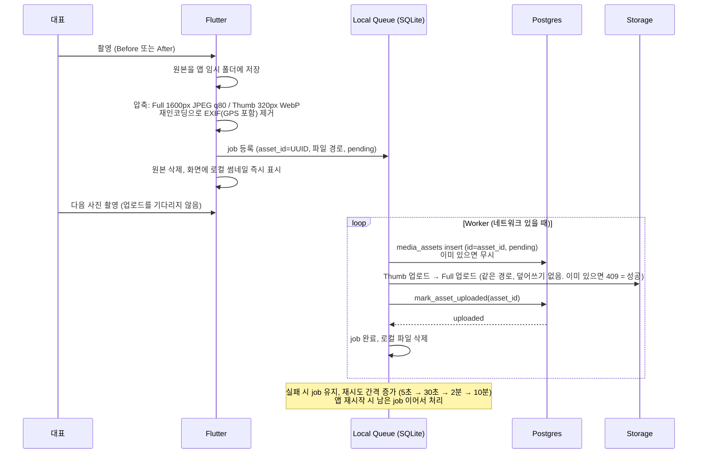

# E. Storage 구조 / F. 사진 Pipeline

## E. Storage 구조

### Bucket

| Bucket | 공개 | 용도 | 설정 |
|--------|------|------|------|
| `project-media` | **Private** | 현장 Before/After 사진 | 허용 MIME: `image/jpeg`, `image/webp` / 파일 크기 제한: 1MB |
| `portfolio-public` | Public | 향후 포트폴리오 (MVP에서 만들지 않음) | — |

### 경로

```text
project-media/
  companies/{company_id}/projects/{project_id}/{asset_id}.jpg      Full (약 1600px, 150~300KB)
  companies/{company_id}/projects/{project_id}/{asset_id}_t.webp   Thumbnail (320px, 약 20KB)
```

- 경로에 고객 이름, 주소, 날짜 같은 정보를 넣지 않는다. id만 사용.
- `asset_id` 는 클라이언트가 만든 UUID. 같은 사진을 다시 올려도 같은 경로라 파일이 두 개 생기지 않는다.
- Company가 경로 첫 단계라, Company 단위 삭제·이전·용량 집계가 경로 prefix 하나로 가능하다.

### Storage 정책 (`storage.objects`)

```sql
-- 업로드/조회/삭제: 경로의 company_id가 내 회사일 때만
CREATE POLICY field_media_member ON storage.objects
  FOR ALL TO authenticated
  USING (
    bucket_id = 'project-media'
    AND (storage.foldername(name))[1] = 'companies'
    AND (storage.foldername(name))[2]::uuid IN (SELECT field.my_company_ids())
  )
  WITH CHECK ( ...같은 조건... );
```

- `anon` 정책 없음. 고객은 서버가 발급한 Signed URL로만 사진을 본다.
- 경로의 project가 실제로 그 회사 것인지는 `mark_asset_uploaded` 가 DB 행과 대조해 확인한다. 대조가 안 된 파일은 `pending` 상태로 남고, 정리 Cron이 지운다.

### Provider 추상화

- DB에는 `provider`, `bucket`, `storage_path`, `thumb_path` 만 저장한다. 전체 URL은 저장하지 않는다.
- URL/서명 생성은 한 곳에서만 한다.
  - Flutter: `lib/core/media_storage/media_storage.dart` (인터페이스) + `supabase_media_storage.dart` (구현)
  - Next.js: `lib/field/media-storage.ts`
- R2/S3로 옮길 때는 이 두 파일과 파일 복사 작업만 바뀐다. Project/PhotoPair 구조는 그대로.

---

## F. 사진 Pipeline



### 단계별 결정

| 단계 | 결정 | 이유 |
|------|------|------|
| 촬영 | 카메라 결과를 앱 전용 폴더에 저장 | 갤러리 권한과 무관하게 Queue가 파일을 보장 |
| 압축 | 기기에서 수행 (예: `flutter_image_compress`) | 원본 업로드 금지. Upload/Storage/Function 비용 절감 |
| EXIF 제거 | 재인코딩 시 메타데이터 미보존 옵션 | 위치정보가 서버에 도달하지 않음. 업로드 전 제거 |
| 썸네일 | **클라이언트에서 생성** | 서버 Image Transformation 비용 없음. 파일 1개 추가(약 20KB)가 목록 Egress를 약 90% 줄임 |
| Queue | SQLite (`sqflite`) | 앱 종료, 재부팅, 네트워크 끊김에도 유지 |
| 순서 | DB 행(pending) → 파일 → 확정 | DB 성공 + 파일 실패 = pending으로 추적 가능. 파일만 있고 행이 없는 고아가 생기지 않음 |
| 중복 방지 | `asset_id` 를 PK와 경로에 동시 사용 | Retry해도 행 1개, 파일 1개 (idempotent) |
| 확정 | `mark_asset_uploaded` RPC가 실제 파일 존재·크기·MIME 검증 | 클라이언트 상태를 신뢰하지 않음 |
| 동시 업로드 | 2개 | 현장 네트워크에서 안정성과 속도 균형 |

### MVP 범위

- 포함: 앱이 켜져 있는 동안의 업로드, 앱 재시작 시 이어하기, 실패 재시도, 업로드 상태 표시(대기/업로드 중/실패).
- 제외: 앱이 완전히 꺼진 상태의 OS 백그라운드 업로드 (`workmanager` 등). 필요성이 확인되면 추가.
- 업로드 대기 중인 사진이 있으면 Report 링크 생성 전에 "업로드 중인 사진 N장" 을 안내한다.

### 표시 (Display)

| 화면 | 로딩 | 방식 |
|------|------|------|
| 앱 현장 상세 | Thumbnail만 | 화면에 보이는 것만 Signed URL batch 요청 (20개 단위), 만료 전까지 메모리 재사용 |
| 앱 사진 크게 보기 | Full | 탭할 때 1장 서명 |
| 고객 Report 첫 화면 | Thumbnail (첫 12쌍) | HTML에 포함, `loading="lazy"`, 고정 width/height로 레이아웃 흔들림 방지 |
| 고객 Report 스크롤 | Thumbnail (24쌍씩) | 끝에 가까워지면 다음 페이지 경로 + Signed URL 요청 |
| 고객 Report 크게 보기 | Full | 탭/확대 시 로드 |

- 이미지 Disk Cache의 키는 **URL이 아니라 `asset_id` + 크기**로 한다. Signed URL이 바뀌어도 같은 사진을 다시 받지 않는다 (Egress 절감).
- 썸네일 Decode 크기를 표시 크기로 제한해 메모리 사용을 줄인다 (`cacheWidth` 등).
- 사진 500장 현장도 공간 단위로 접고 펼쳐 한 번에 모두 렌더링하지 않는다.

### 삭제 / 정합성

| 상황 | 처리 |
|------|------|
| 사진 삭제 | `deleted_at` 설정 (즉시 화면/Report에서 제외). 파일은 정리 Cron이 삭제 |
| 현장 삭제 | `projects.deleted_at` 설정. 30일 뒤 정리 Cron이 해당 prefix 파일 삭제 후 행 Hard Delete |
| pending 7일 경과 | 파일이 있으면 삭제, 행 삭제 |
| `failed` | 앱 Queue에서 재시도 또는 사용자에게 다시 촬영 안내 |

정리 Cron은 SQL로 `storage.objects` 를 직접 지울 수 없으므로(Supabase 제한) Storage API로 삭제한다. Vercel Cron → `app/api/cron/field-cleanup` 에서 서버 전용 key로 batch 처리. 30일 보관은 향후 Trash / Retention 정책의 기반이 된다.
